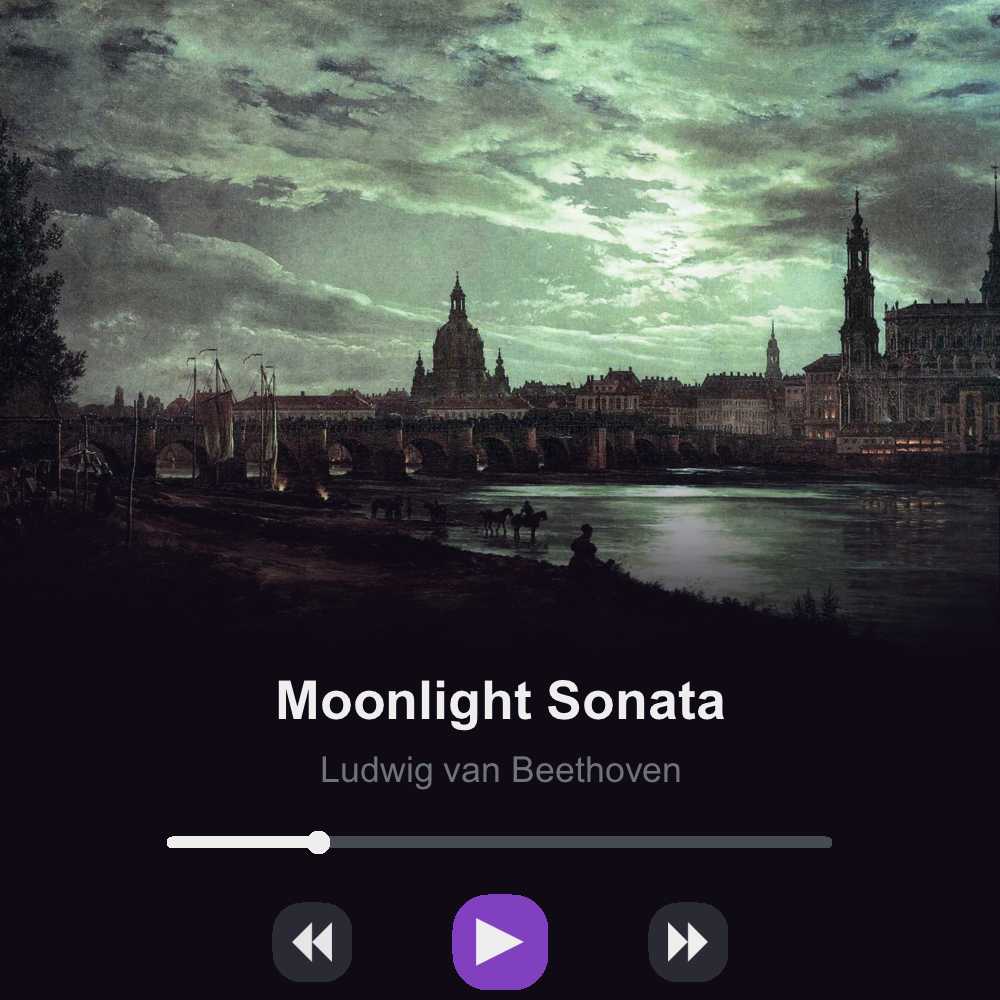
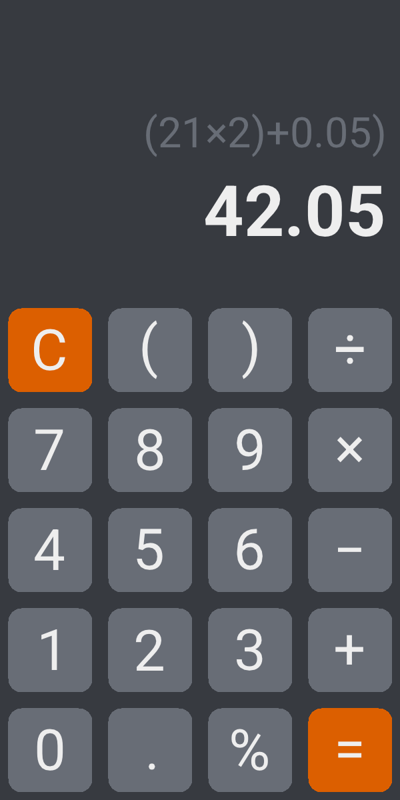
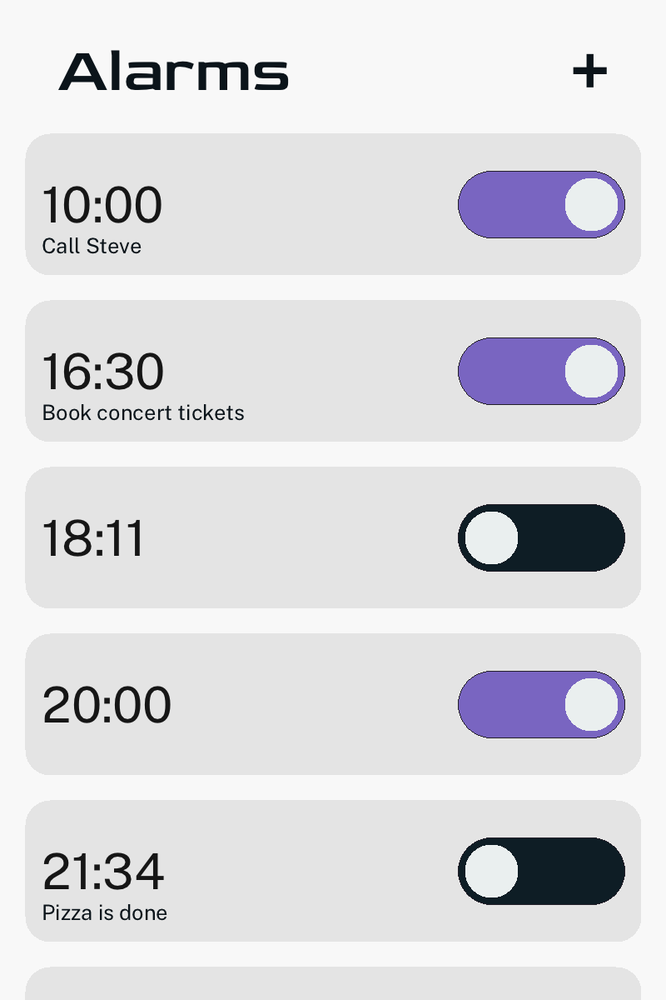

# Welcome to Click! 🧩
Click is a modern, simple, and yet remarkably versatile GUI layouting, rendering, and interactivity framework written in and for the ASPL programming language.

 &nbsp; &nbsp;  &nbsp; &nbsp; 

Using Click, it becomes playfully easy to **compose beautiful and portable graphical applications** in ASPL, allowing you to **abstract away from implementation details** towards what really matters. Click also, as the name implies, provides a **powerful unified API** to handle **different types of user input** on various platforms, which greatly helps to keep code bases concise and makes porting apps to new operating systems astonishingly effortless. The **optimized state handler** prevents a whole class of bugs and inconsistencies and allows for very **clean and performant immediate-mode code**.

Everything in Click is based on **widgets**, which are implemented as classes. Complex interfaces are built using **composition** and **inheritance**. **States have to be subscribed** to by widgets that depend on them. Most sizes and virtually all positions are dynamically calculated at runtime, as Click is built around the **flexbox design pattern**.

> [!IMPORTANT]
> Click is still in early beta, with some features missing or incomplete. It is not yet recommended for production use.

## Getting Started
Please refer to the [Click Manual](MANUAL.md) for detailed instructions on installing Click, building your first app, the principles and decisions that govern the development of Click, and more.

You can also check out the [showcase examples](examples/) for inspiration and to get a feel for how proper Click code is written.

## Contributing
Contributions of all kinds, including issues, pull requests, and critical feedback, are always welcome! Proper contributing guidelines and tips will be added soon.

## Credits and Licensing
Click is available under the very permissive [zlib license](LICENSE.txt). Like most open-source projects, it is developed and maintained by volunteers in their spare time. 💚

Click's design and implementation were mainly influenced by Flutter and Clay, two very different but equally amazing open-source GUI frameworks. Make sure to check them out as well! 📖